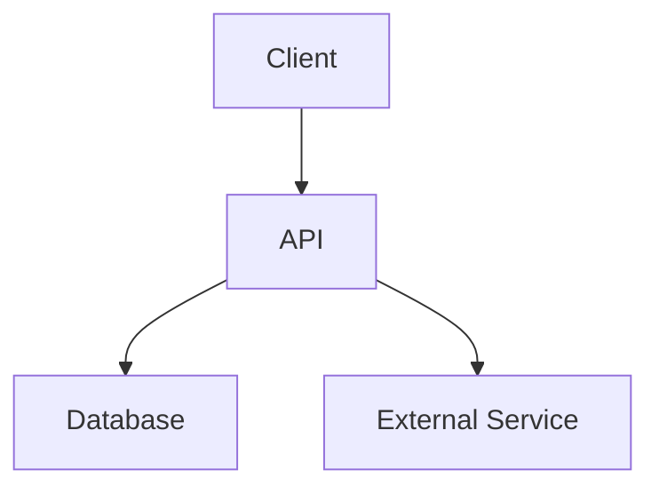

# Architecture Overview

## System Diagram

## Key Components

### [Component 1]
- **Purpose:** [what it does]
- **Location:** `src/[path]`
- **Dependencies:** [what it depends on]

## External Dependencies

| Service | Purpose | Docs |
|---------|---------|------|
| [e.g., Shopify API] | [Product management] | [link] |

## Environment Variables

| Variable | Purpose | Required |
|----------|---------|----------|
| [DATABASE_URL] | [DB connection] | Yes |
